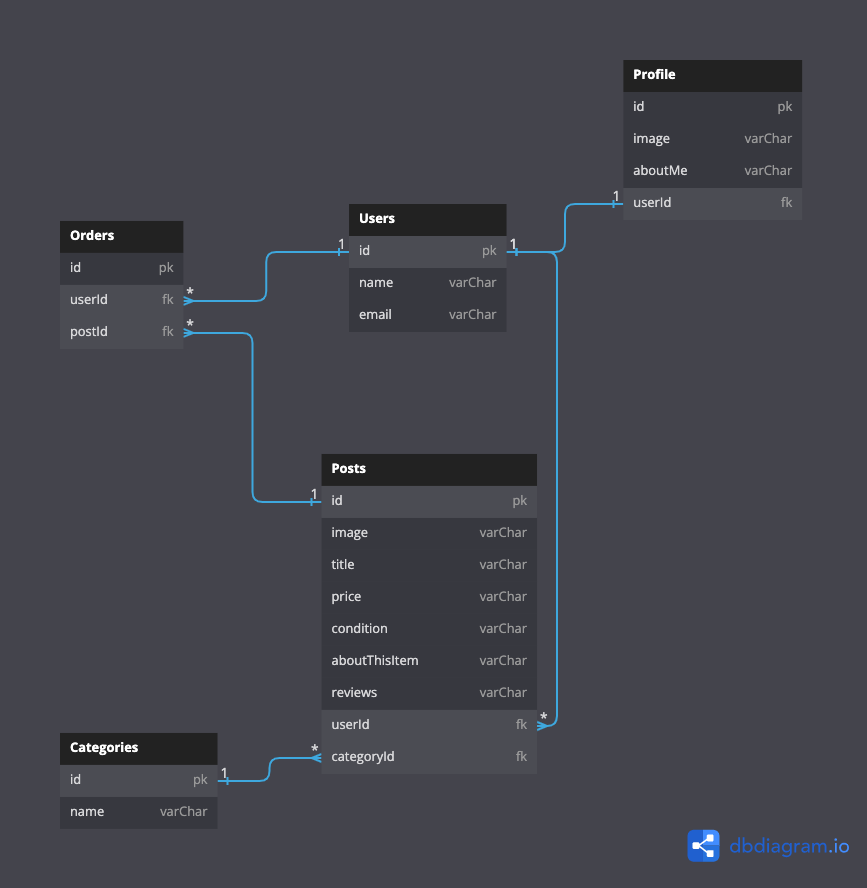

## Litter Box Loot

<b style="font-size: 20px;"><i>E-commerce for cats!</i></b>

### Application Overview

Litter Box Loot is my front end capstone that acts as an e-commerce app for cats to display and sell products.

I built this application in two weeks initially, using React Hooks and CSS for styling. My goals were to incorporate full CRUD functionality, gain a deeper understanding of React Hooks, props, and state, while also incorporating an intuitive, functional user interface, without the use of bootstrapped components.

### Features

<p>
• Users can search for items they are interested in buying.<br>
• Users can buy items. <br>• Users can post items they wish to sell.<br>• Users can edit their own items.<br>• Users can delete their own items.<br>• Users view their own profile.<br>• Users view other seller's own profiles.
</p>

### Technologies Used

       

### Running This Application

#### First, a note about authentication...

This application uses mock authentication which is purely for demonstration purposes. Therefore the login and registration code written here is completely insecure and would never be implemented in a professional application.

#### Now that we've cleared that up...

1. Clone this repository and change to the directory in the terminal.

```sh
git clone git@github.com:JulieAF/litter-box-loot.git
cd litter-box-loot
```

2. Access the data.

<a href="https://github.com/JulieAF/litter-box-loot-api" target="_blank"></a>

3. Launch the client.

```sh
    npm install
    npm start
```

#### ERD



#### Created by Julie Foster

<a href="https://github.com/JulieAF" target="_blank"></a> <a href="https://www.linkedin.com/in/julie-angelica-foster/" target="_blank"></a>
